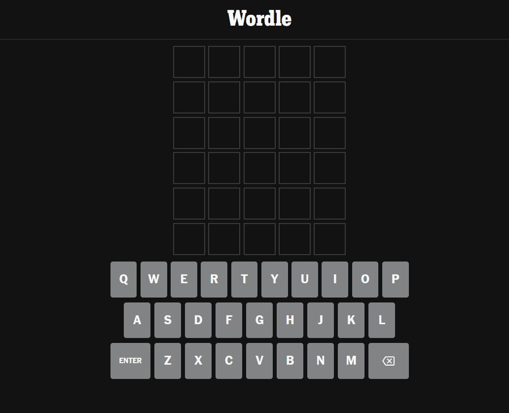
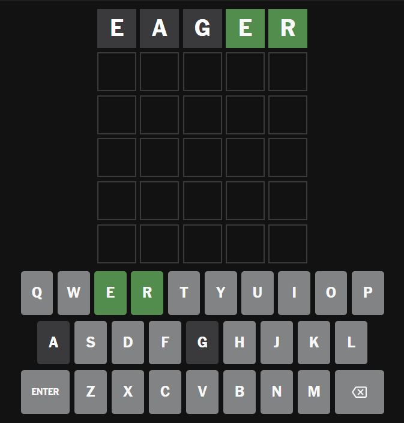

# Creating a Wordle App from Scratch

## Server with Database or Not?

- ideally we'd have a server and the answer would be hidden from the client
  - players couldn't cheat by inspecting the answer in dev tools
  - this would allow a leaderboard
  - different scores depending on the number of attempts
- Reasons I'm not going the server+auth+database route:
  - the main purpose of the project is to build something in TypeScript (which is relatively new to me)
  - this is a simple app for a portfolio project
    - I already have two paid Render servers
    - I'd have to modify an existing server to do it for free
    - it requires auth
    - it requires using a database
  - all of this adds too much work and takes focus away from using TypeScript to create something that should be relatively simple
  - if the Wordle word is randomly chosen on the frontend we can just let the user complete the puzzle and then immediately create a new game
  - if the Wordle word is chosen on the backend then we are stuck with either having no auth and have the word expire at 12:00pm and create a new word at 12:01am OR we have auth and store the current word on a per user basis in a database
    - again, this is very doable but it is time consuming

## What we'll need

- first we need the [words](https://dagshub.com/arjvik/wordle-wordlist/src/master/answerlist.txt "text file of Wordle answers on github ")
  - there are 12,947 allowed answers
  - there are about 2,309 game answers so far
  - the allowed answers are obscure:
    - words such as abrin, abris, absey, absit, abuna, abune will be accepted as valid guesses
  - I've chosen to use the 2309 words that have been used as game answers so far
- local storage to persist through refreshes/navigation away from the page
- state: current game answer, the current guess index, letters used, previous guesses, whether a letter has been guessed, whether a letter is in the correct position, whether a letter is in the incorrect position
- a killer name. I thought Wurdil and then googled to see if it meant anything. Wur Dil means "The Heart" in Urdu, so that's cool. Wurdil in Western Frisian means "Word." Wurdil Wedstriid - literally word game

---

## NYT Wordle: How it works

- 6 chances to guess a 5-letter word
- the Wordle play area:
  

### Non-touch device

- input letters via keyboard or using the mouse with the keyboard displayed under the guesses, and they appear in the current guess boxes
- you must hit or click enter to submit your guess:
  
- letters which are in the word:
  - but in the wrong place are yellow
  - but in the right place are green
- to submit a guess, the guess must be in the word list
- keys that are not A-Z, enter or delete are ignored
- warn on submit if not enough letters
